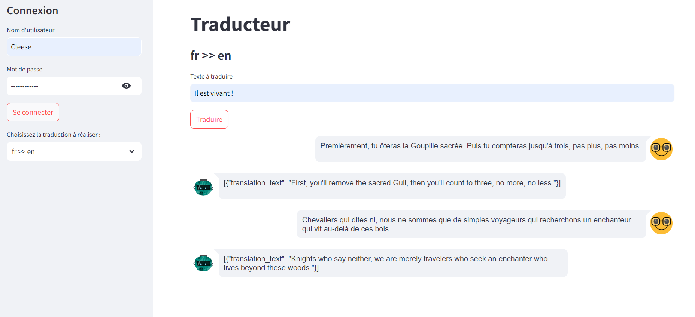

# Ticket d'incident 3

## Étapes pour reproduire le problème
1. Saisir l'URL "localhost:8501" et valider pour charger l'application web Traducteur.

## Résultat actuel
L'application affiche le volet de connexion et le traducteur.
Si on se connecte avec le compte **Cleese** / **Sacré Graal!**, il n'y a aucun effet sur la vue.

## Comportement attendu
- Avant l'authentification d'un compte reconnu, l'application doit afficher le volet de connexion et une page d'accueil.
- Après l'authentification d'un compte reconnu, l'application doit afficher le bouton de **déconnexion** et la page du traducteur.
- Lors d'une déconnexion, l'application retrouve son état initial.

Le traducteur ne doit être affiché que pour les comptes utilisateurs authentifiés.

